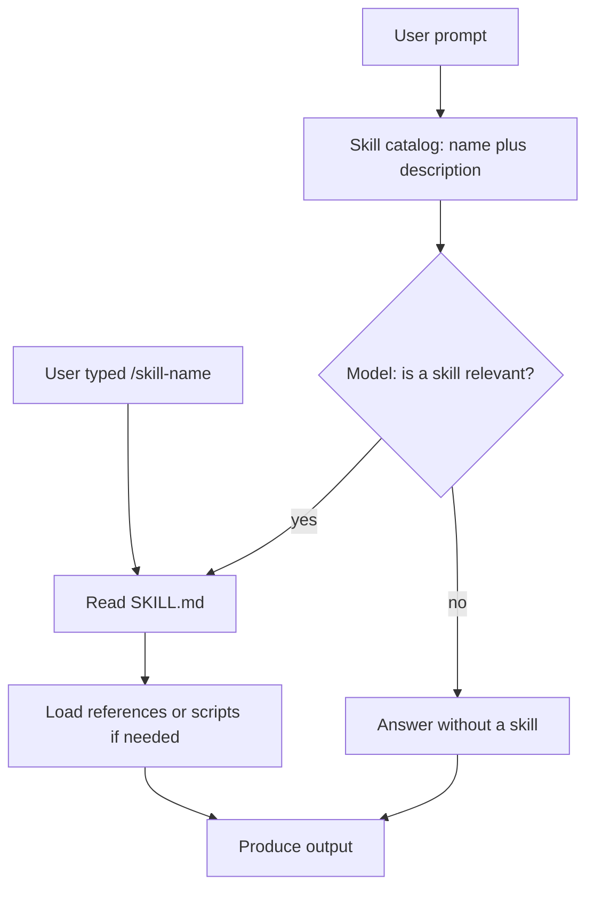

# Skill Observatory

Local Go CLI that measures whether installed Cursor/Claude agent skills actually fire, and whether they improve output.

It answers:

1. Does the model pick the relevant skill, and does that help?
2. For one skill, does its description trigger on the right prompts, and does the body improve the answer?
3. Which skills ran, on which prompts?

## Install

```bash
make install
```

That builds the binary and copies it to `~/.local/bin/skill-observatory` (override with `PREFIX`). Confirm with `skill-observatory version`.

To run from the repo without installing:

```bash
go build -o bin/skill-observatory ./cmd/skill-observatory
./bin/skill-observatory discover
```

Optional config: `~/.config/skill-observatory/config.yaml` (see `config.example.yaml`). Set `OPENAI_API_KEY` or `ANTHROPIC_API_KEY` for evals.

## Commands

```bash
skill-observatory discover
skill-observatory inventory
skill-observatory log --skill resume-ats-optimizer
skill-observatory eval generate golang-error-handling
skill-observatory eval trigger golang-error-handling --catalog-mode full
skill-observatory eval quality golang-error-handling
skill-observatory report
```

`discover` and `log` need no API key. Trigger and quality evals call an LLM over HTTP.

Seed fixtures live in `evals/` for `golang-error-handling`, `resume-ats-optimizer`, and `canvas`.

## Tests and CI

```bash
make test
make test-race
make lint
```

GitHub Actions runs the same suite on every push and pull request to `main`:

- **Tests** — `go test -race -shuffle=on` on Go 1.26 and stable, plus `go mod tidy`
- **Lint** — `go vet` and golangci-lint

## How an LLM invokes a skill

Cursor does not run a separate router. At boot it injects every skill's **name + description**. The model then decides whether to read `SKILL.md`, or you force that with `/skill-name`.



## How measurement works

Cursor only injects skill **name + description**. The model then **reads `SKILL.md`** (or you attach the skill with `/`).

- **Transcript log** parses `~/.cursor/projects/*/agent-transcripts/**/*.jsonl` for manual attaches and `Read` of `SKILL.md`.
- **Trigger eval** sends the catalog of names+descriptions and asks which skills the model would read. Reports precision, recall, F1, and clashes.
- **Quality eval** runs the same prompt with and without the skill body, then a blind LLM judge.

Slash-only skills (`disable-model-invocation: true`) are skipped for auto-trigger scoring.
